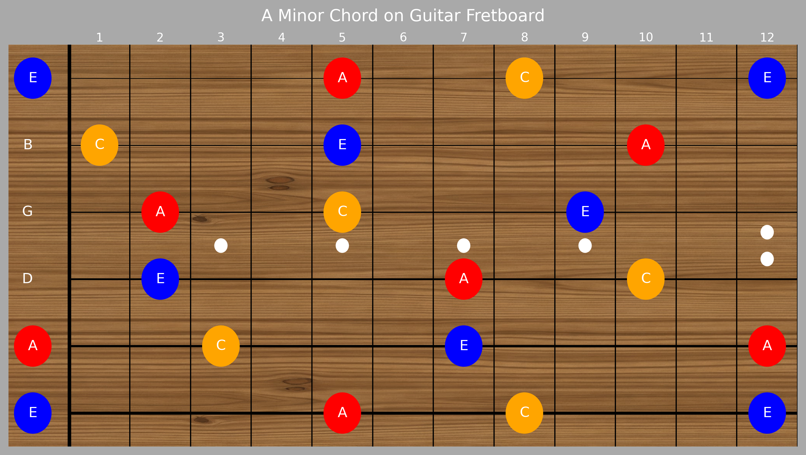

# Guitar Fretboard Visualizer

A Python script to generate fretboard diagrams for chords and scales on guitars with customizable tunings and string counts. Ideal for guitarists looking to visualize chords, scales, and practice different patterns across the fretboard.

## Features

- **Generate Fretboard Diagrams**: Create visual representations of chords and scales.
- **Custom Tunings and String Counts**: Support for 6-string, 7-string, and even 8-string guitars with any tuning.
- **Color-Coded Notes**: Visualize root notes and intervals with distinct colors.
- **Practice Mode**: Randomize parameters like root note, pattern type, and pattern name for dynamic practice sessions.
- **Save Diagrams**: Automatically saves the generated fretboard diagrams as image files.
- **Command-Line Interface**: Easy to use with optional interactive prompts.

## Installation

### Prerequisites

- Python 3.x
- `matplotlib` library

### Install Matplotlib

You can install `matplotlib` using `pip`:

```bash
pip install matplotlib
```

### Clone the Repository

```bash
git clone https://github.com/yourusername/guitar-fretboard-visualizer.git
cd guitar-fretboard-visualizer
```

## Usage

Run the script using Python:

```bash
python fretboard_diagram.py [root_note] [pattern_type] [pattern_name] [tuning] [num_frets]
```

- **`root_note`**: The root note of the chord or scale (e.g., `C`, `F#`, `Bb`).
- **`pattern_type`**: Either `Chord` or `Scale`.
- **`pattern_name`**: Name of the chord or scale (e.g., `Major`, `Minor 7th`, `Pentatonic Minor`).
- **`tuning`**: *(Optional)* Comma-separated tuning notes (e.g., `B,E,A,D,G,B,E` for a 7-string guitar). Default is standard tuning `E,A,D,G,B,E`.
- **`num_frets`**: *(Optional)* Number of frets to display. Default is `12`.

If you run the script without arguments, it will prompt you for input.

### Examples

#### Generate an A Minor Chord Diagram

```bash
python fretboard_diagram.py A Chord Minor
```

#### Generate a G Major Scale Diagram with Drop D Tuning

```bash
python fretboard_diagram.py G Scale Major D,A,D,G,B,E
```

#### Use Practice Mode

Activate practice mode to randomize parameters for practice:

```bash
python fretboard_diagram.py --practice
```

You'll be prompted to specify tuning, number of frets, and which parameters to randomize.

## Practice Mode Instructions

In practice mode, you can choose which parameters to randomize:

- **Root Note**
- **Pattern Type** (`Chord` or `Scale`)
- **Pattern Name** (e.g., `Major`, `Minor 7th`, `Pentatonic Minor`)

### Steps:

1. **Run Practice Mode**

   ```bash
   python fretboard_diagram.py --practice
   ```

2. **Specify Tuning and Number of Frets**

   The script will prompt you to enter tuning and the number of frets. Press `Enter` to use default values.

3. **Select Parameters to Randomize**

   You'll be asked which parameters you want to randomize. Enter `y` for yes and `n` for no.

4. **Generate Diagrams**

   The script will generate diagrams based on your selections. After each diagram, you can choose to generate another or exit.

## Available Patterns

### Chords

- Major
- Minor
- Diminished
- Augmented
- Dominant 7th
- Major 7th
- Minor 7th
- Half-Diminished 7th
- Diminished 7th
- Suspended 2nd
- Suspended 4th

### Scales

- Major
- Natural Minor
- Harmonic Minor
- Melodic Minor
- Pentatonic Major
- Pentatonic Minor
- Blues

## Tuning

Provide custom tuning by specifying a comma-separated list of notes from **lowest to highest** pitch.

- **Standard 6-String Tuning**: `E,A,D,G,B,E`
- **7-String Guitar Tuning**: `B,E,A,D,G,B,E`
- **Drop D Tuning**: `D,A,D,G,B,E`

## Saving Diagrams

The generated fretboard diagrams are saved as PNG files in the current directory with filenames in the format:

```
<root_note>_<pattern_name>_<pattern_type>_fretboard.png
```

Example:

```
A_Minor_Chord_fretboard.png
```

## Example Output



*An example fretboard diagram generated for an A Minor chord.*


## Dependencies

- Python 3.x
- Matplotlib (`pip install matplotlib`)

## Contributing

Contributions are welcome! Please follow these steps:

1. **Fork the Repository**

2. **Create a Feature Branch**

   ```bash
   git checkout -b feature/YourFeature
   ```

3. **Commit Your Changes**

   ```bash
   git commit -am 'Add some feature'
   ```

4. **Push to the Branch**

   ```bash
   git push origin feature/YourFeature
   ```

5. **Create a Pull Request**

## License

This project is licensed under the MIT License - see the [LICENSE](LICENSE) file for details.

## Acknowledgments

- Inspired by the desire to help guitarists visualize chords and scales on the fretboard.
- Thanks to all contributors and users who provide feedback and enhancements.
